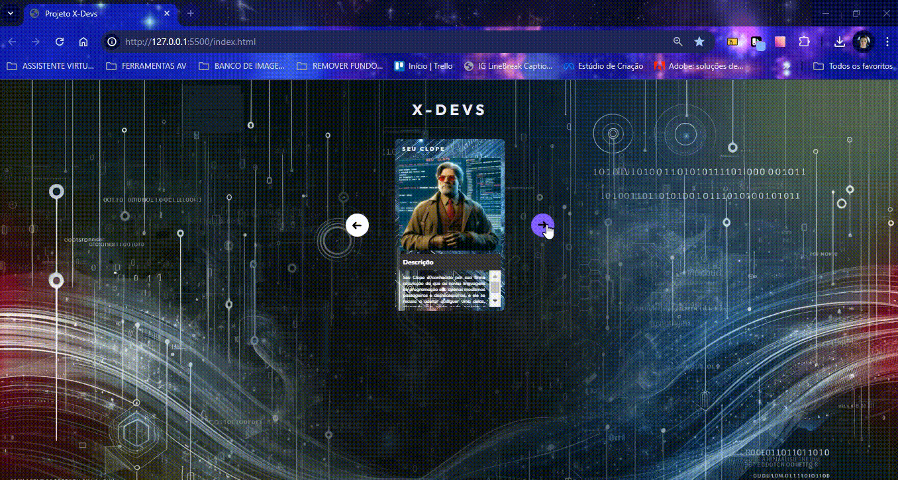
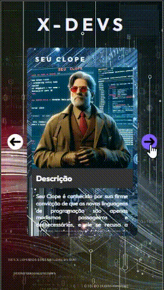

# Projeto X DEVS

Um projeto Landing Page X DEVS com personagens desenvolvedores de tecnologias contendo nome, desenho e descrição. Para conhecer cada personagem, existem 2 botões com setas direcionando para a direita ou para esquerda nos lados clicáveis.
Para telas de desktops, tablets e celulares 📲💻

## Tecnologias utilizadas
- HTML
- CSS
- JAVASCRIPT

## 📂 Acesso ao projeto

Você pode acessar o código fonte do projeto 

<https://github.com/denisero19/projeto-x-devs>
